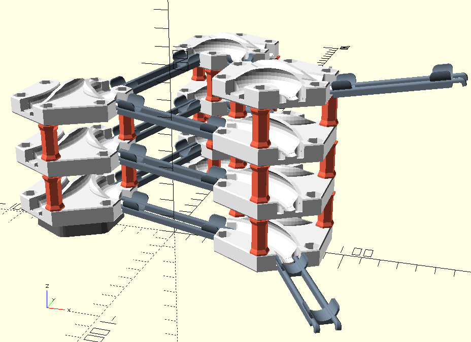
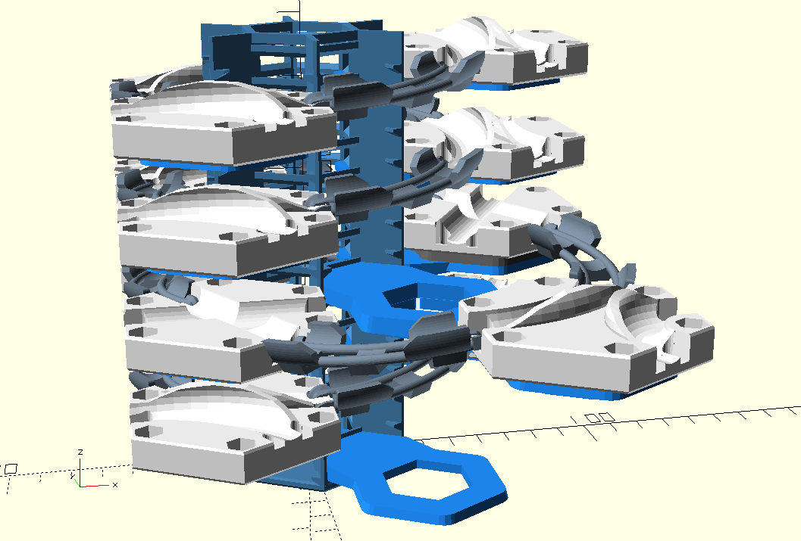
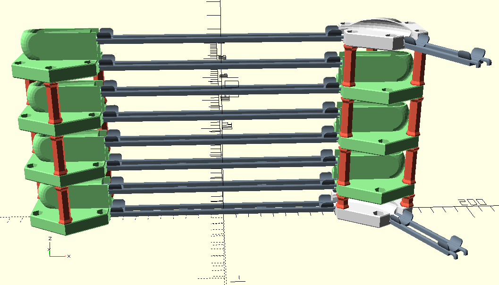

# gravitrax-extensions

3D models for gravitrax parts not available for sale from Ravensburger. 

## Stacking tiles

Stack tiles on top of tiles.

* Stackable tiles: [gt_tiles/](gt_tiles/)
* Stacking rods: [gt_stack/](gt_stack/)

## Tower 

Insert platforms for tiles directly into the tower. 
This is more robus than the original "vertical" elements.

* Tower and platforms:  [gt_tower/](gt_tower/)

## Spacers

These spacers have a hole in the middle for marbles to pass through .

* Spacers:  [gt_spacer/](gt_spacer/)

## U-Turn

* Stacking rods: [gt_stack/](gt_stack/)
* U-Turn Tile: [gt_tiles/TileUTurn.stl](gt_tiles/TileUTurn.stl)

