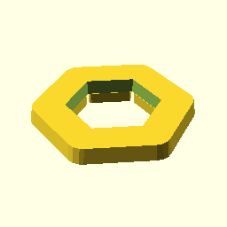
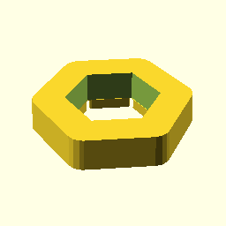
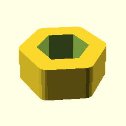

\n****\n\n\n\n    use <gt_spacer.scad>\n    \n\n
 Gravitrax compatible spacers with a hole in the middle
 for the marble to fall through.

**Spacer(5);**

    use <gt_spacer.scad>
    Spacer(5);

[Spacer_5.stl](Spacer_5.stl)

**Spacer(10);**

    use <gt_spacer.scad>
    Spacer(10);

[Spacer_10.stl](Spacer_10.stl)

**Spacer(20);**

    use <gt_spacer.scad>
    Spacer(20);

[Spacer_20.stl](Spacer_20.stl)

**Spacer(30);**

    use <gt_spacer.scad>
    Spacer(30);

[Spacer_30.stl](Spacer_30.stl)

**Spacer(50);**

    use <gt_spacer.scad>
    Spacer(50);

[Spacer_50.stl](Spacer_50.stl)

/////////////////////////////////////////////////////////////////
