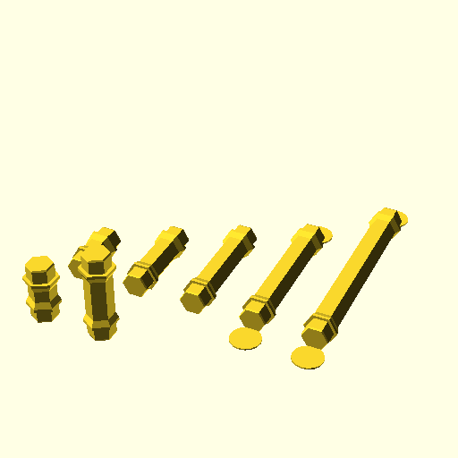

****

    use <gt_stack.scad>
    

**Stack(10, standing=1);**

    use <gt_stack.scad>
    Stack(10, standing=1);

[Stack_10_standing_1.stl](Stack_10_standing_1.stl)

**Stack(20, standing=1);**

    use <gt_stack.scad>
    Stack(20, standing=1);

[Stack_20_standing_1.stl](Stack_20_standing_1.stl)

**Stack(10);**

    use <gt_stack.scad>
    Stack(10);

[Stack_10.stl](Stack_10.stl)

**Stack(20);**

    use <gt_stack.scad>
    Stack(20);

[Stack_20.stl](Stack_20.stl)

**Stack(30);**

    use <gt_stack.scad>
    Stack(30);

[Stack_30.stl](Stack_30.stl)

**Stack(40, mouseear=1);**

    use <gt_stack.scad>
    Stack(40, mouseear=1);

[Stack_40_mouseear_1.stl](Stack_40_mouseear_1.stl)

**Stack(60, mouseear=1);**

    use <gt_stack.scad>
    Stack(60, mouseear=1);

[Stack_60_mouseear_1.stl](Stack_60_mouseear_1.stl)

