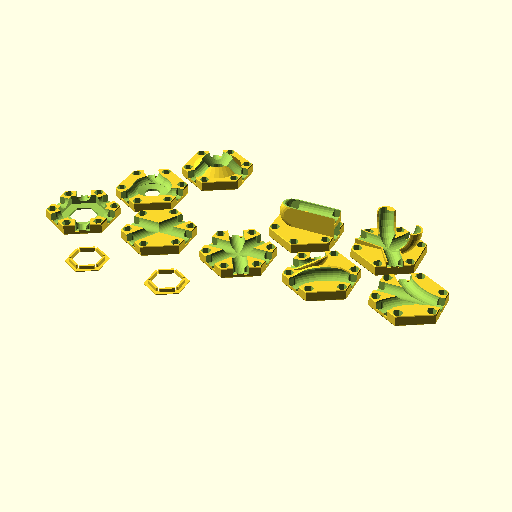

****

    use <gt_tiles.scad>
    

**Ring(petg=1);**

    use <gt_tiles.scad>
    Ring(petg=1);

[Ring_petg_1.stl](Ring_petg_1.stl)

**Ring();**

    use <gt_tiles.scad>
    Ring();

[Ring.stl](Ring.stl)

**TileBase();**

    use <gt_tiles.scad>
    TileBase();

[TileBase.stl](TileBase.stl)

**TileX();**

    use <gt_tiles.scad>
    TileX();

[TileX.stl](TileX.stl)

**TileStraight();**

    use <gt_tiles.scad>
    TileStraight();

[TileStraight.stl](TileStraight.stl)

**TileCurves();**

    use <gt_tiles.scad>
    TileCurves();

[TileCurves.stl](TileCurves.stl)

**TileY();**

    use <gt_tiles.scad>
    TileY();

[TileY.stl](TileY.stl)

**TileCyclone();**

    use <gt_tiles.scad>
    TileCyclone();

[TileCyclone.stl](TileCyclone.stl)

**TileUTurn();**

    use <gt_tiles.scad>
    TileUTurn();

[TileUTurn.stl](TileUTurn.stl)

**TileYoyo();**

    use <gt_tiles.scad>
    TileYoyo();

[TileYoyo.stl](TileYoyo.stl)

**TileVulcano();**

    use <gt_tiles.scad>
    TileVulcano();

[TileVulcano.stl](TileVulcano.stl)

